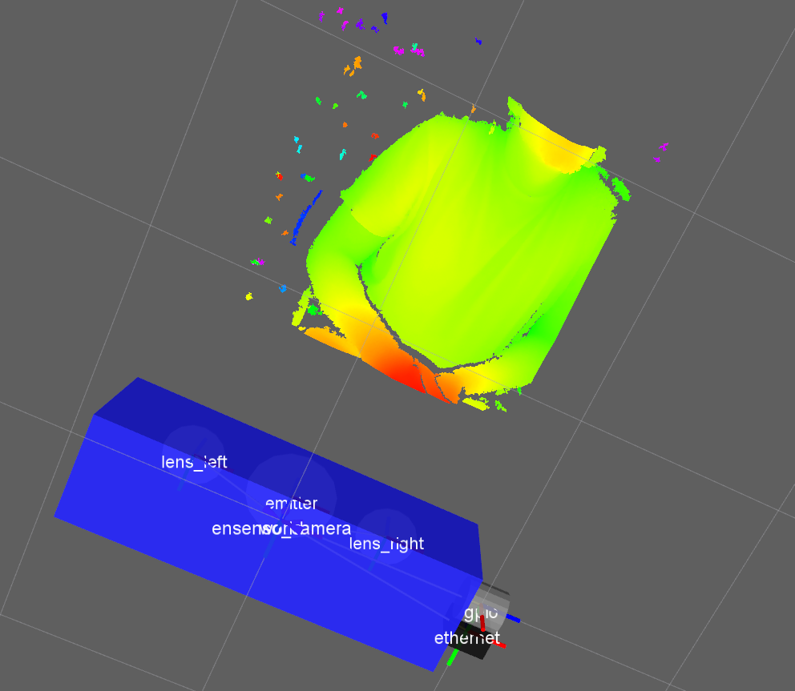

### Overview
This repository holds code of a [ROS](http://www.ros.org) package for point cloud acquisition with  [EnsensoNx](https://en.ids-imaging.com/ensenso-stereo-3d-camera.html) 3D cameras. It is basically a ROS wrapper of the low-level API provided by [IDS](https://en.ids-imaging.com), the manufacturer of the camera. The ROS node can be configured to act as a server or as publisher at a given rate.



### Dependencies
The package has been tested with the following dependencies:
* Ubuntu 16.04
* CMake + gcc
* [ROS Kinetic](http://wiki.ros.org/kinetic)
* [Point Cloud Library v1.7](http://www.pointclouds.org/) (shipped with ROS Kinetic)
* UEYE driver 4.81.1 (camera interface from manufacturer IDS)
* Ensenso SDK 1.3.18 and 2.0.140 (propietary library from manufacturer IDS)

To install the ueye driver and tools:

1. Download the UEYE from the [IDS website](http://www.ensenso.com/support/sdk-download/) (file uEye_4.81.1_Linux_64.tgz)
2. Uncompress, move to the folder and run the script (ethernet or usb as needed)
```shell
$ sudo sh ./ueyesdk-setup-4.80-eth-amd64.gz.run
```

To install Ensenso SDK dependency:

1a. Download the SDK from the [IDS website](http://www.ensenso.com/support/sdk-download/) (file ensenso-sdk-2.0.140-x64.deb)

1b. Install it with
```shell
$ sudo dpkg -i ensenso-sdk-2.0.140-x64.deb
```

2a. Download SDK additional package from the [IDS website](http://www.ensenso.com/support/sdk-download/) (file codemeter_6.40.2402.501_amd64.deb)

2b. Install it with
```shell
sudo dpkg -i /home/andreu/Desktop/codemeter_6.40.2402.501_amd64.deb
```

3a. At the end of your ~/.bashrc file, add the following line: 
```shell
export ENSENSO_INSTALL=/opt/ensenso
```

3b. Do not hesitate to source again your .bashrc, or open a new terminal. 


### Download and Build This ROS package
Download to your ROS workspace /src, with the command:
```shell
$ git clone https://github.com/beta-robots/ensenso_nx.git
```
and from your ROS workspace, build it with:
```shell
$ catkin_make --only-pkg-with-deps ensenso_nx
```

### Camera Operation
Start the ueye daemon (in case it didn't started on system boot):
```shell
$ sudo /etc/init.d/ueyeethdrc start
```
Decide whether you want to operate the camera as a publisher or as a server, by setting the run_mode parameter of the config/ensenso_nx_params.yaml file. Thereafter, run the node (by default a rviz window will appear)
```shell
$ roslaunch ensenso_nx ensenso_nx.launch
```
If you are running the node in mode "SERVER", from another terminal please request a Point Cloud capture, providing the dense point cloud flag and a given exposure value (0 meaning autoexposure):
```shell
$ rosservice call /ensenso_nx/ensenso_server "dense_cloud: false exposure: 0"
```

### Troubleshooting
The IDS application nxView shows 3D realtime data, and allows to manage all parameters involved in the stereo computation.
```shell
$ nxView
```

Check that the IP of the computer and that of the camera are in the same network. To manually set the IP of the camera, or manage other configurations, go to:
```shell
$ ueyecameramanager
```

In some cases you have to manually edit the file **/usr/local/share/ueye/ueyeethd/ueyeethd.conf** with sudo privileges and set the interface and port. For instance, if you are using eth0 interface, the file should look like:
```shell
;ueye configuration file

[Parameters]
Interfaces = eth0

[eth0]
Port_Base = 50000
```

Sometimes you have to stop the ueye daemon an then start it again
```shell
$ sudo /etc/init.d/ueyeethdrc stop
$ sudo /etc/init.d/ueyeethdrc start
```
